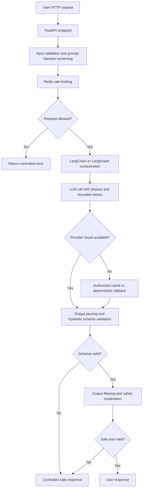
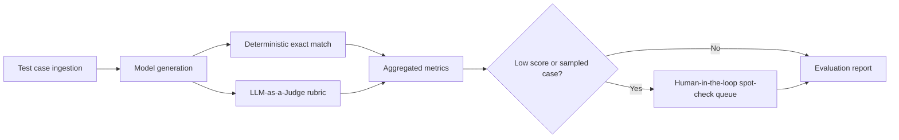

# Enterprise LLM Guardrail & Evaluation Engine

A Python service for deploying LLM applications with input and output safeguards, resilient model execution, and measurable quality. It pairs a FastAPI serving path with an evaluation harness so teams can manage safety, reliability, and regression risk as an application moves into production.

> **Project status:** The API and evaluation CLI are implemented. Live generation requires a configured provider API key and Redis instance.

## Project Aim

- Move an LLM proof of concept or demo toward a production-grade service with explicit request contracts, operational limits, and observable failure paths.
- Replace subjective “vibes” with repeatable scoring, including exact match, rubric-based judging, and human spot-checks.
- Prevent runaway API costs through Redis-backed rate limits, bounded retries, timeouts, and controlled evaluation runs.
- Handle provider outages and malformed responses gracefully with safe, deterministic fallback behavior.
- Make safety decisions auditable across input validation, prompt injection screening, output parsing, and moderation.

## Architecture & System Flow

### System architecture



Validation rejects malformed or disallowed requests before a provider call. Both primary and fallback outputs pass through the same schema and safety checks; a failed check returns a controlled response rather than unchecked model text.

### Evaluation harness pipeline



Evaluation cases should be versioned with their inputs, expected outputs, and rubric criteria. Store the model version, prompt version, run configuration, and judge rationale with each result so regressions can be investigated.

## Solution & Implementation Breakdown

| Layer | Core technologies | Responsibility |
| --- | --- | --- |
| API and contracts | Python, FastAPI, Pydantic | Accept requests, validate payloads, return typed responses and controlled errors. |
| Orchestration | LangChain Core | Format role-separated prompts and reference context for model calls. |
| Model providers | OpenAI or Anthropic APIs | Generate responses behind a provider adapter and explicit timeout policy. |
| Traffic controls | Redis | Enforce per-client request limits and protect provider budgets. |
| Evaluation | Python CLI, model judge, human review | Run JSONL test sets, score outputs, and flag cases for human review. |
| Documentation | Mermaid.js | Keep request and evaluation flows visible in this README. |

### Module 1: Input & Output Guardrails

**Input controls** validate types and lengths with Pydantic, reject empty requests, and screen prompts for common prompt injection patterns. The LangChain prompt template labels reference context as untrusted data. The screening rules are a first layer and cannot detect every injection attempt. Apply **Redis-backed rate limits** by authenticated API key before calling a paid model; return `429` when a client exceeds its allowance. If Redis is unavailable, the API returns `503` rather than bypassing the limit.

**Output controls** parse the model response into a strict Pydantic schema, reject missing or invalid fields, and filter obvious secret disclosures before release. Set `MODERATION_MODE=openai` to run hosted safety moderation on model and cached answers; a flagged result or moderation outage moves to a safe cache or deterministic fallback. The default `local` mode is a baseline filter, not comprehensive content moderation. Review the moderation policy for your use case before handling high-risk content. Logs record failure types without prompt text or API keys.

### Module 2: Resiliency & Fallback Strategy

**Model execution:** Supports OpenAI and Anthropic through provider adapters.

Set an explicit **provider timeout** and a small **retry limit** for transient failures such as timeouts or throttling. Retries use exponential backoff with jitter and fit within an overall provider-call deadline. Validation failures are not retried.

If the primary provider remains unavailable or returns an invalid response, use a valid cached response when its client scope, prompt, context, model, prompt version, and TTL match. Otherwise return a deterministic, schema-valid response that explains the temporary limitation. The response reports `model`, `cache`, or `fallback` in its `source` field.

### Module 3: Evaluation Harness

| Measure | Method | Use |
| --- | --- | --- |
| **Exact match** | Normalize the generated and expected answers, then compare them deterministically. | Regression checks for constrained answers and known facts. |
| **Faithfulness** | Ask an LLM judge whether claims are supported by the supplied reference context. | Detect unsupported claims in grounded responses. |
| **Completeness** | Ask an LLM judge whether the response covers the required points in a written rubric. | Detect omissions that exact match would miss. |
| **Human spot-check** | Sample cases and flag low-scoring, high-risk, or judge-disputed results for review. | Calibrate the judge and inspect failure modes. |

The CLI reports overall exact-match rate and mean judge scores, and records category and risk per case for downstream analysis. It writes individual outputs and judge rationales to JSONL; handle this file as potentially sensitive data. Judge scores are signals that require calibration against human review, not ground truth.

## Quickstart & Usage Example

The commands below run the implemented FastAPI application and evaluation CLI.

### Prerequisites

- Python **3.9+** and `pip`.
- A reachable **Redis** instance for the API's rate limiter (the evaluation CLI does not require Redis).
- An **OpenAI or Anthropic API key** for live API calls and evaluations. Automated tests do not need a key.

### Setup

1. Create and activate a virtual environment:

   ```bash
   python3 -m venv .venv
   source .venv/bin/activate
   ```

2. Install dependencies:

   ```bash
   pip install -r requirements.txt
   ```

   To run the automated tests, install `requirements-dev.txt` instead; it includes the application dependencies.

3. Start Redis locally or set `REDIS_URL` to an existing instance. Configure the environment and keep keys out of source control. You can copy `.env.example` to `.env`, fill in the values, and let the application load it automatically:

   ```bash
   cp .env.example .env
   ```

   Use the provider's **API model ID** in `.env`; for GPT-6 Astra, the ID is [`gpt-6-astra`](https://developers.openai.com/api/docs/models/gpt-6-astra). Set `OPENAI_API_KEY` to your OpenAI Platform API key. For the API endpoint, set `APP_API_KEYS` to a separate client secret of your choice. Alternatively, export values in the same terminal before running the application:

   ```bash
   export LLM_PROVIDER=openai
   export LLM_MODEL="gpt-6-astra"
   export OPENAI_API_KEY="your-api-key"
   export APP_API_KEYS="replace-with-a-long-random-client-key"
   export REDIS_URL="redis://localhost:6379/0"
   export LLM_TIMEOUT_SECONDS=15
   export LLM_MAX_RETRIES=2
   export MODERATION_MODE=openai
   ```

   A plain `LLM_MODEL=value` shell assignment is not inherited by a later `python` command; use `export` or `.env`. For Anthropic, set `LLM_PROVIDER=anthropic` and `ANTHROPIC_API_KEY`. Keep `OPENAI_API_KEY` if using `MODERATION_MODE=openai`; otherwise set `MODERATION_MODE=local`.

4. Start the API:

   ```bash
   uvicorn app.main:app --host 127.0.0.1 --port 8000
   ```

5. Call the guarded endpoint:

   ```bash
   curl -X POST http://127.0.0.1:8000/v1/generate \
     -H "Content-Type: application/json" \
     -H "X-API-Key: replace-with-a-long-random-client-key" \
     -d '{"prompt":"What is the capital of France?","context":"The capital of France is Paris."}'
   ```

6. Run the evaluation harness against the included example case:

   ```bash
   python -m evals.run --cases evals/cases.jsonl --output evals/results.jsonl
   ```

   The CLI prints aggregate metrics and writes per-case JSONL results. It uses the selected provider, guarded generation, and a separate judge call without serving rate limits or cached answers. Runs are capped at **100 cases** by default; use `--max-cases` to set an explicit limit.

### Test locally and save a report

Run the automated tests first. They use fake providers and do not need an API key or Redis:

```bash
pip install -r requirements-dev.txt
pytest -v -ra
```

For a live smoke test, start Redis in another terminal. If Docker is available, one option is:

```bash
docker run --rm --name llm-guardrail-redis -p 127.0.0.1:6379:6379 redis:7-alpine
```

Export the variables in step 3 and start the API with the command in step 4. In a second terminal, check readiness with `curl http://127.0.0.1:8000/health/ready`, then send the `curl` request in step 5. A successful live provider call returns `"source":"model"`; `"source":"cache"` or `"source":"fallback"` means the service returned a degraded response.

To run a **live evaluation**, configure a model and its provider key in the same terminal. For OpenAI:

```bash
export LLM_PROVIDER=openai
export LLM_MODEL="gpt-6-astra"
export OPENAI_API_KEY="your-api-key"
export MODERATION_MODE=openai
```

For Anthropic, use `LLM_PROVIDER=anthropic`, `ANTHROPIC_API_KEY`, and an Anthropic `LLM_MODEL`. Set `MODERATION_MODE=local`, or keep an `OPENAI_API_KEY` for hosted moderation. The evaluation CLI does not require `APP_API_KEYS` or Redis.

Verify that the evaluator sees your settings without displaying the secret:

```bash
python -c 'from app.config import Settings; s = Settings.from_env(require_app_api_keys=False); print("provider:", s.provider, "model:", s.model, "API key loaded:", bool(s.api_key))'
```

Then save a readable evaluation report plus machine-readable results:

```bash
mkdir -p reports
python -m evals.run --cases evals/cases.jsonl --output reports/results.jsonl --report reports/evaluation.md --html-report reports/evaluation.html --summary reports/summary.json
```

Open `reports/evaluation.html` in a browser for a visual report with aggregate metrics and case details, or `reports/evaluation.md` for a compact text report. The HTML report includes prompts, reference context, expected answers, and generated or replayed answers; handle it as potentially sensitive local data. `reports/summary.json` contains aggregate metrics for automation; `reports/results.jsonl` retains detailed case records and may also contain sensitive model output. Check **`degraded_count`** in the summary and each case's **`source`**: `fallback` means the model answer was unavailable, so that case did not receive an LLM judge score. The starter `evals/cases.jsonl` has one case; the next section provides a larger example set.

### Generate a report from concrete examples

The repository includes six example cases in `evals/sample_cases.jsonl` and saved responses in `evals/sample_replay.jsonl`. They cover a grounded fact, return and shipping policies, email extraction, an instruction hidden in reference context, and an unsupported warranty claim. The saved responses deliberately get two cases wrong so the report has visible failures.

For example, the return-policy case asks **“What is the return window?”** with reference text **“Customers may return unopened products within 30 days of delivery.”** Its expected answer is `30 days`; the saved answer is `14 days`, so exact match fails. The warranty case has no supported duration, expects `I do not know`, and deliberately replays `Two years`. You can edit either JSONL file to try your own prompts and answers; keep one replay answer with the same `id` for each case.

Run this **offline replay** to generate a report without an API key or Redis:

```bash
python -m evals.run --cases evals/sample_cases.jsonl --replay evals/sample_replay.jsonl --output reports/sample-results.jsonl --report reports/sample-evaluation.md --html-report reports/sample-evaluation.html --summary reports/sample-summary.json
```

Open `reports/sample-evaluation.html` in a browser (`open reports/sample-evaluation.html` on macOS) to inspect each input and answer, `reports/sample-evaluation.md` for the text report, or `reports/sample-results.jsonl` for raw results. The supplied examples produce **4 exact matches out of 6 (66.7%)**; human review flags cover mismatches, high-risk cases, and the configured spot sample. Replay does **not** call a model or LLM judge, so judge metrics are blank and replay results must not be presented as live model performance. To evaluate these same cases against your configured provider, omit `--replay` and use separate output names:

```bash
python -m evals.run --cases evals/sample_cases.jsonl --output reports/live-results.jsonl --report reports/live-evaluation.md --html-report reports/live-evaluation.html --summary reports/live-summary.json
```

If a run logs `Generation degraded`, the safe diagnostic includes either an HTTP status and recognized code/parameter, or a fixed `reason` such as `timeout`, `transport_error`, or `malformed_response`. For OpenAI, `401` points to authentication, while `429` can mean rate or quota limits; inspect the code before retrying. The [OpenAI API error guide](https://developers.openai.com/api/docs/guides/error-codes) lists the specific causes. For `reason=timeout`, review `LLM_TIMEOUT_SECONDS` and `REQUEST_DEADLINE_SECONDS`. The LibreSSL warning from some macOS Python installations is separate from the provider failure.

### Configuration reference

| Variable | Purpose | Example |
| --- | --- | --- |
| `LLM_PROVIDER` | Selects the model provider. | `openai` or `anthropic` |
| `LLM_MODEL` | Provider model identifier. | A model available to your account |
| `OPENAI_API_KEY` / `ANTHROPIC_API_KEY` | Authenticates with the selected provider. | Secret value |
| `APP_API_KEYS` | Comma-separated client keys accepted in `X-API-Key`. | Long random secret values |
| `REDIS_URL` | Connects to the rate-limit store. | `redis://localhost:6379/0` |
| `RATE_LIMIT_PER_MINUTE` | Maximum requests per client key per calendar minute. | `30` |
| `LLM_TIMEOUT_SECONDS` | Bounds an individual provider call. | `15` |
| `REQUEST_DEADLINE_SECONDS` | Bounds provider calls and retry delays. | `30` |
| `LLM_MAX_RETRIES` | Limits retries after transient failures. | `2` |
| `CACHE_TTL_SECONDS` | Retains successful responses for fallback use. | `300` |
| `MODERATION_MODE` | `openai` enables hosted output moderation; `local` applies baseline filtering. | `local` |

### API and evaluation contracts

`POST /v1/generate` accepts `{"prompt": "...", "context": "..."}` and requires `X-API-Key`. It returns `answer`, `source`, and `request_id`. Request validation errors return `422`; blocked injection patterns return `400`; invalid keys return `401`; rate limits return `429`; Redis failure returns `503`. `GET /health/live` and `GET /health/ready` provide liveness and Redis readiness checks.

Each evaluation case JSONL line contains `id`, `prompt`, `expected`, and optional `context`, `required_points`, `category`, and `risk` (`high` flags human review). Each replay JSONL line contains the matching `id` and an `answer`; an optional `judge` object may provide `faithfulness`, `completeness`, and `rationale` from a separate assessment. Replay IDs must match case IDs exactly. Run tests with `pip install -r requirements-dev.txt` followed by `pytest -v -ra` to see every test name and result.
